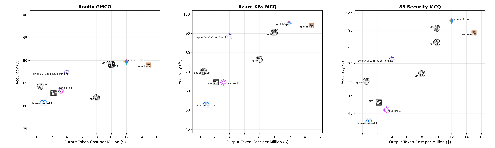

# SRE-skills-bench ⚗️

> *Benchmarks LLMs on SRE-type tasks!*

This benchmark evaluates Large Language Models on tasks commonly performed by Site Reliability Engineers, helping reliability practitioners choose the right model for the job, whether it's powering IDE assistants, automating operational workflows, or improving incident response. Think of SRE-skills-bench as the SWE-bench of Site Reliability Engineering. 



At the Rootly AI Labs, we run evals on frontier models the day they are released, and we share our findings on our social media platforms ([LinkedIn](https://linkedin.com/company/rootlyhq/), [X](https://x.com/rootlyhq)). We also present our benchmarks at leading ML research conferences, including as workshop papers at NeurIPS 2025, ICML 2025 and ACL 2025.

## Findings

The table below represents the average accuracy of each model across all SRE-related tasks included in the benchmark.

| Model | Output Token Cost (per M) | Rootly GMCQ | Azure K8s MCQ | S3 Security MCQ |
|-------|---------------------------|-------------|---------------|-----------------|
| gemini-3-pro 🏆 | $12.00 | 89.7% | 95.3% | 95.7% |
| gpt-5.1 | $10.00 | 89.2% | 90.2% | 82.6% |
| sonnet-4.5 | $15.00 | 89.0% | 94.0% | 88.4% |
| gpt-5 | $10.00 | 89.0% | 90.6% | 91.3% |
| qwen3-vl-235b-a22b-thinking | $3.95 | 87.3% | 88.5% | 72.5% |
| gpt-oss-120b | $0.50 | 84.3% | 70.1% | 59.4% |
| nova-pro-1 | $3.20 | 83.3% | 64.5% | 42.0% |
| glm-4.6 | $2.20 | 82.8% | 64.5% | 46.4% |
| gpt-4.1 | $8.00 | 81.8% | 76.5% | 63.8% |
| llama-4-maverick | $0.85 | 80.8% | 53.0% | 34.8% |

## Getting Started

To reproduce our results or use our benchmark to benchmark other models.

```bash
# Create a virtual environment and install OpenBench
uv venv
source .venv/bin/activate
uv pip install openbench


#Set your API key (any provider!)
export GROQ_API_KEY=your_key  # or OPENAI_API_KEY, ANTHROPIC_API_KEY, etc.

#Run Rootly’s benchmark
bench eval gmcq --model "groq/llama-3.1-8b-instant" --T subtask=mastodon
```

## Methodology

SRE-skills-bench evaluates models on tasks that represent real, day-to-day SRE responsibilities.  
Each task category includes multiple test cases with expected outputs, graded programmatically or via structured evaluation. For each test, we open-source 40% of the entire dataset, available on our [HF repo 🤗](https://huggingface.co/rootly-ai-labs).

### GitHub Multiple Choice Questions Benchmark (GMCQ)

GMCQ evaluates a model's ability to understand code changes during pull requests, which can assist SREs during rapid responses to critical incidents. GMCQ's dataset consists of real-world pull requests and code diffs from six popular GitHub repositories that actively publish new version releases. Each question consists of a real pull request's issue description, and four choices of real code diffs all sourced from the same repository. Only one code diff corresponds to that specific pull request, and the model must be able to identify the correct code diff. To achieve a strong performance on this benchark, the model must be capable of understanding code functionality when given textual instructions and limited context. 

This GMCQ benchmark was presented by the Rootly AI Labs as a workshop paper at ICML 2025 and ACL 2025.


### Terraform SRE Benchmark 

This benchmark evaluates a model's ability to understand common code requests for SREs. Each question in this benchmark provides the model with a specific request and presents 4 code diffs of Terraform code and instructions that resolve similar requests. The model must select the correct choice of code diff.

This benchmark contains a wide array of scenarios, including compute, network, kubernetes and security requests on AWS, GCP and Azure. For a model to perform well on this benchmark, it must be able to demonstrate generalizable understanding of SRE requests across a wide array of tasks and target platforms, making this benchmark relevant to determine relevant models that can assist SREs in their day-to-day work.


## Where we share our findings

|Conference Name| Date|
|--- | --- |
| ER @ NeurIPS | Dec. 2-7, 2025 |
| KnowFM @ ACL 2025 | July 27 to Aug. 1, 2025 |
| New In ML @ ICML 2025 | July 13-19, 2025 |

## 🔗 About the Rootly AI Labs
SRE-skills-bench is built with ❤️ by the [Rootly AI Labs](https://rootly.com/ai-labs) for engineering teams everywhere. The Rootly AI Labs is a fellow-led community designed to redefine reliability engineering. We develop innovative prototypes, create open-source tools, and produce research that's shared to advance the standards of operational excellence. We want to thank Anthropic, Google Cloud, and Google DeepMind for their support.
