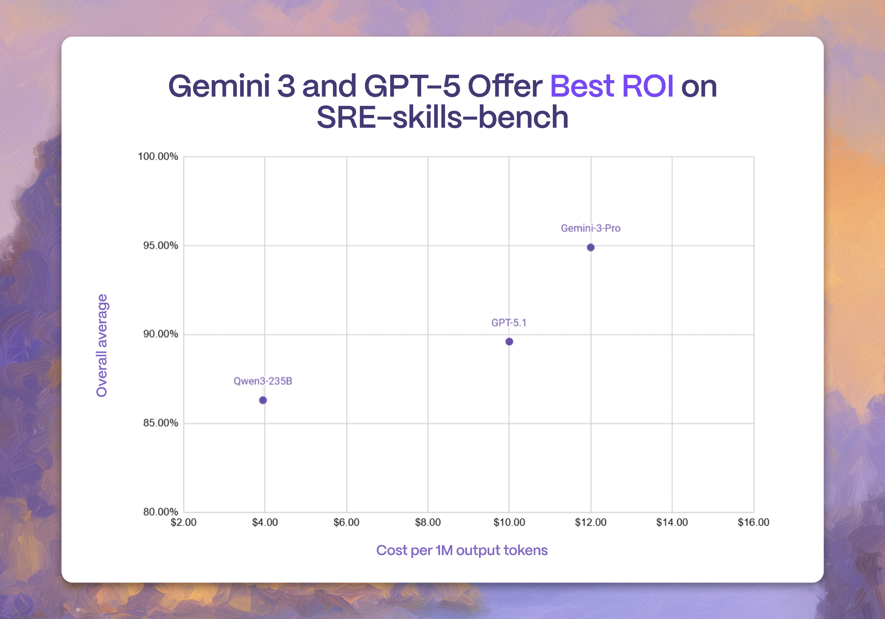

# SRE-skills-bench

<h2 align="center">
 <br>
 
</h2>

[](https://opensource.org/licenses/Apache-2.0)
[](https://www.python.org/downloads/)

> *Can Language Models Resolve SRE Tasks?*

SRE-skills-bench evaluates LLMs on tasks commonly performed by Site Reliability Engineers, helping reliability practitioners choose the right model for the job, whether it's powering IDE assistants, automating operational workflows, or improving incident response. Think of SRE-skills-bench as the SWE-bench of Site Reliability Engineering. 

Read our latest findings with Gemini 3 Pro on our [blog post](https://rootly.com/blog/gemini-3-lead-in-sre-tasks).



At the Rootly AI Labs, we run SRE-skills-bench on frontier models the day they are released, and we share our findings on our social media platforms ([LinkedIn](https://linkedin.com/company/rootlyhq/), [X](https://x.com/rootlyhq)). We also present our benchmarks at leading ML research conferences, including as workshop papers at NeurIPS, ICML, and ACL.

## Findings

The table below represents the average accuracy of each model across all SRE-related tasks included in the benchmark.

| Org | Model | SRE-skills-bench score | Ouput Token Cost (per M) | Run Date |
|-----|-------|------------------------|---------------------------|------|
|  | gpt-5.2-pro 🏆 | 95.34% | $168.00 💸 | Dec. 12, 2025 |
|  | gemini-3-pro | 94.88% | $12.00 | Nov. 24, 2025 |
|  | opus-4.5 | 92.93% | $25.00 | Nov. 24, 2025 |
|  | sonnet-4.5 | 92.71% | $15.00  | Nov. 24, 2025 |
|  | gpt-5.1-codex-max | 92.50% | $10.00 | Dec. 10, 2025 |

**👉 Visit our website [sreskillsbench.com](https://sreskillsbench.com/) to have access to all the findings.**

## 📰 News
* **[Dec. 2, 2025]**: [presenting our work](https://x.com/LaurenceLiang1/status/1993446585062375710?s=20) at ER – NeurIPS in San Diego, USA.
* **[Nov. 24, 2025]**: [released](https://rootly.com/blog/gemini-3-lead-in-sre-tasks) ~3,000 new tasks testing LLMs on compute, network, and storage actions across AWS, GCP, and Azure.
* **[Jul. 27, 2025]**: [presented](https://x.com/LaurenceLiang1/status/1950315795248222646?s=20) our work at KnowFM – ACL 2025 in Vienna, Austria.
* **[Jul. 19, 2025]**: [presented](https://www.linkedin.com/posts/rootlyhq_icml-last-week-was-packed-with-the-people-activity-7353091496885084160-Kg6h?utm_source=share&utm_medium=member_desktop&rcm=ACoAAADGnFABrpDYk0E2FAxG_0rQwv3fcQbkd7E) our work at New In ML – ICML 2025 in Vancouver, Canada.

## Getting Started

To reproduce our results or use our benchmark to benchmark other models.

```bash
# Create a virtual environment and install OpenBench
uv venv
source .venv/bin/activate
uv pip install openbench

# Set your API key (any provider!)
export GROQ_API_KEY=your_key  # or OPENAI_API_KEY, ANTHROPIC_API_KEY, etc.

# Run Rootly's benchmark
bench eval gmcq --model "groq/llama-3.1-8b-instant" --T subtask=mastodon
```

### Running the Automation Script

To run evaluations across all SRE tasks using the automation script:

```bash
# Copy the example env file and add your API keys
cp scripts/.env.example scripts/.env
# Edit scripts/.env with your API keys

# Run the evaluation script
cd scripts
./run-all-sre-skills-bench-tasks.sh
```

Results will be saved to a timestamped CSV file.

## Methodology

SRE-skills-bench evaluates models on tasks that represent real, day-to-day SRE responsibilities.  
Each task category includes multiple test cases with expected outputs, graded programmatically or via structured evaluation. For each test, we open-source 40% of the entire dataset, available on our [HF repo 🤗](https://huggingface.co/rootly-ai-labs).

### GitHub Multiple Choice Questions Benchmark (GMCQ)

GMCQ evaluates a model's ability to understand code changes during pull requests, which can assist SREs during rapid responses to critical incidents. GMCQ's dataset consists of real-world pull requests and code diffs from six popular GitHub repositories that actively publish new version releases. Each question consists of a real pull request's issue description, and four choices of real code diffs, all sourced from the same repository. Only one code diff corresponds to that specific pull request, and the model must be able to identify the correct code diff. To achieve a strong performance on this benchmark, the model must be capable of understanding code functionality when given textual instructions and limited context. 

This GMCQ benchmark was presented by the Rootly AI Labs as a workshop paper at ICML 2025 and ACL 2025.


### Terraform SRE Benchmark 

This benchmark evaluates a model's ability to understand common code requests for SREs. Each question in this benchmark provides the model with a specific request and presents 4 code diffs of Terraform code and instructions that resolve similar requests. The model must select the correct choice of code diff.

This benchmark contains a wide array of scenarios, including compute, network, Kubernetes, and security requests on AWS, GCP, and Azure. For a model to perform well on this benchmark, it must be able to demonstrate a generalizable understanding of SRE requests across a wide array of tasks and target platforms, making this benchmark relevant to determine relevant models that can assist SREs in their day-to-day work.

## 🔗 About the Rootly AI Labs
SRE-skills-bench is built with ❤️ by the [Rootly AI Labs](https://rootly.com/ai-labs) for engineering teams everywhere. The Rootly AI Labs is a fellow-led community designed to redefine reliability engineering. We develop innovative prototypes, create open-source tools, and produce research that's shared to advance the standards of operational excellence. We want to thank Anthropic, Google Cloud, and Google DeepMind for their support.
